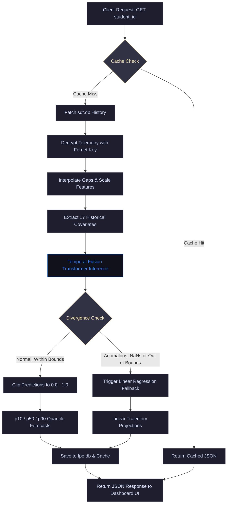

# State Future Prediction Engine (FPE) — Student Wellness Forecasting

Welcome to the official repository of the **State Future Prediction Engine (FPE)**. This engine forecasts the trajectory of student wellness states over a 7-day forecast horizon (with extensibility to 14 and 30 days) to identify gradual declines in wellness before they manifest as critical health issues.

FPE operates as **Module 5** of the Wellmate wellness platform, utilizing deep temporal self-attention models to deliver quantile forecasts.

---

## 1. Detailed Execution Flowchart

The forecasting lifecycle processes telemetry data, executes self-attention forecasting, and routes queries through caching and anomaly fallback pathways:



---

## 2. Core Model Architecture (Temporal Fusion Transformer)

The deep learning model is built using a custom light-weight **Temporal Fusion Transformer (TFT)** designed to run efficiently on low-resource environments (CPUs):

* **Inputs & Features**:
  * **17 Historical Covariates**: 10 primary dimensions (stress, anxiety, fatigue, social, academic, burnout, sleep, mood, resilience, focus) + 7 engineered rolling metrics (Academic Workload Pressure, Day of Week Sine/Cosine, 7-Day Sleep Volatility, 7-Day Stress Volatility, 7-Day Stress Delta, Sleep-to-Stress Ratio).
  * **3 Future Known Covariates**: Workload Academic Pressure, Day of Week Sine/Cosine.
  * **10 Static Covariates**: Student average state baselines.
* **Quantile Outputs**: Decoder maps hidden states to 3 target quantiles:
  * **10th Percentile (p10)**: Optimistic/Lower bound forecast.
  * **50th Percentile (p50)**: Median/Most likely forecast trajectory.
  * **90th Percentile (p90)**: Pessimistic/Upper bound forecast.
* **Gate mechanisms**: Utilizing **Gated Residual Networks (GRN)** and **Gated Linear Units (GLU)** to filter out redundant features.
* **Complexity**: **4,628 parameters** (extremely lightweight, CPU latency $< 60\text{ ms}$).

### Linear Regression Fallback
If the TFT model encounters extreme anomalies (severe drift, values exceeding the $[-0.5, 1.5]$ threshold, or NaNs), it triggers a `LinearBaselineFallback` model leveraging `scikit-learn` to project linear trajectories while raising backend warnings.

---

## 3. Model Evaluation & Results Graphs

The TFT model has been evaluated on a hold-out test set (20% of the cohort):

### 3.1 Evaluation Summary Metrics
| Metric | Target Threshold | Evaluated Value | Status |
|---|---|---|---|
| **Quantile Loss (Pinball Loss)** | $< 0.08$ | **0.01804** | **PASSED** |
| **Mean Absolute Scaled Error (MASE)** | $< 1.10$ | **0.59286** | **PASSED** |
| **Prediction Drift (Wasserstein Distance)** | Info Only | **0.01793** | **HEALTHY** |

---

### 3.2 Shaded Quantile Forecast Trajectory (Quantile Forecast Sample)
This line plot demonstrates a sample multi-quantile forecast for a student's stress level:
* **Timeline (X-Axis)**: Measured relative to the forecast epoch (Day 0 represents "today"). Historical lookback covers days `-13` to `0` (14 days), while the forecast horizon spans days `1` to `7` (7 days).
* **Stress Score Value (Y-Axis)**: Normalized index between `0.0` (optimal/low stress) and `1.0` (critical stress).
* **Historical Lookback (Gray Circle Line)**: Actual student telemetry parsed from `sdt.db`.
* **Actual Trajectory (Green Square Line)**: Ground truth future timeline.
* **Predicted Median (p50 - Blue Triangle Line)**: The model's primary predicted path.
* **90% Confidence Band (Shaded Light Blue)**: Shaded range bounded by the 10th percentile (`p10` lower dashed limit) and 90th percentile (`p90` upper dashed limit). A wider band indicates higher forecasting uncertainty (typically during high-stress exam periods), while a narrow band indicates a stable, high-confidence trajectory.


---

### 3.3 Model Regression Performance (Actual vs. Predicted Stress)
This scatter plot validates the forecasting accuracy of the median (`p50`) stress predictions against the ground truth on all validation time-steps:
* **Axes**: Ground truth stress index is mapped to the X-axis, and model-predicted stress is mapped to the Y-axis.
* **Perfect Prediction Line (Red Dashed Diagonal)**: Represents the ideal scenario where predictions exactly match the actual values ($y = x$).
* **Data Density (Green Circles)**: Validation predictions cluster closely along the diagonal, proving that the TFT attention mechanism accurately tracks non-linear fluctuations (such as mid-semester workload peaks) rather than returning flat baseline averages.


---

### 3.4 Top 10 Feature Importances (Permutation Importance)
This horizontal bar chart displays the top 10 historical features that contribute most to the model's forecasting performance:
* **Permutation Importance Metric**: Computed by measuring the increase in Mean Squared Error (MSE) on the validation set when shuffling each feature's sequence values. A larger increase represents a higher dependency on that covariate.
* **Scores**: Normalized to a relative scale between `0.0` and `1.0`.
* **Key Observations**: Primary indices like `stress` and `anxiety` show high importance, which is expected. Critically, engineered features like `sleep_stress_ratio` (stress buffering) and `academic_pressure` (distance to exams) carry significant relative importance scores, confirming that our feature engineering pipeline provides vital context for predicting wellness trends.


---

---

## 4. Pre-Configured Test Cohort

To demonstrate different student wellness trajectories in real-time, the database comes pre-populated with **30 days of custom daily history** for 4 distinct student profiles inside `sdt.db`:

1. **`std-9874` (High Burnout Trajectory)**: Exhibits a steady, linear rise in burnout (starting at `0.15` and climbing to `0.73` by day 30).
2. **`std-1001` (Midterm Anxiety Cycle)**: Shows a classic stress/anxiety spike centered around the midterm exam date (Day 18), which successfully recovers back to normal.
3. **`std-1002` (Chronic Sleep Debt)**: Displays high fatigue and extremely low sleep quality (`~0.22`) due to cumulative sleep debt, leading to moderate-high burnout (`~0.63`).
4. **`std-1003` (Stable/Resilient Profile)**: Balanced wellness indices (low stress, low anxiety, high resilience, and stable mood).

---

## 5. Local Setup & Deployment

### Prerequisites
* Python 3.10+
* Virtual Environment

### Installation
1. Clone the repository:
   ```bash
   git clone https://github.com/tezendrax/FPE-Student-State-Forecasting-Engine--Wellmefy.git
   cd FPE-Student-State-Forecasting-Engine--Wellmefy
   ```
2. Install dependencies:
   ```bash
   pip install -r requirements.txt
   ```

### Running the Pipeline
* **Generate Synthetic Data**:
  ```bash
  python scripts/generate_data.py
  ```
* **Train the TFT Model**:
  *(Trains for 30 epochs with early stopping patience of 15 epochs and Adam optimizer $lr = 10^{-3}$)*
  ```bash
  python scripts/train_model.py
  ```
* **Evaluate the Trained Checkpoint**:
  ```bash
  python scripts/evaluate_model.py
  ```
* **Generate Evaluation Graphs**:
  ```bash
  python scripts/generate_plots.py
  ```
* **Populate Test DB with Cohorts**:
  ```bash
  python scripts/populate_test_history.py
  ```

### Launching the Dashboard and API Server
1. Start the FastAPI server:
   ```bash
   python run_server.py
   ```
   *The server runs on http://localhost:8003.*
2. Open http://localhost:8003/ in your browser. The dashboard interface includes:
   * Rebranded **"State Future Prediction Engine"** logo.
   * Student selector dropdown for the 4 preloaded profiles.
   * **Custom Student ID** input field that reveals itself dynamically.
   * Responsive interactive line charts (solid p50, dashed p10/p90 confidence limits).
   * Diagnostic telemetry indicators (Inference Latency, MASE, Quantile Loss).

---

## 6. Score Interpretation Guide

All wellness parameters are normalized on a scale from **0.0 to 1.0**:

* **🟢 Low Range (0.0 – 0.3)**: 
  * Good for risk factors (e.g. Stress, Anxiety, Burnout, Fatigue).
  * Deficit for protective boosters (e.g. Sleep quality, Mood, Focus, Resilience).
* **🟡 Moderate Range (0.3 – 0.7)**: 
  * Transition/Typical activity levels. Requires baseline observation and monitoring.
* **🔴 High Range (0.7 – 1.0)**: 
  * Critical alert for risk factors (requires preventive interventions).
  * Optimal/Healthy for protective boosters.

---

## 7. License

This project is licensed under the MIT License - see the LICENSE file for details.
