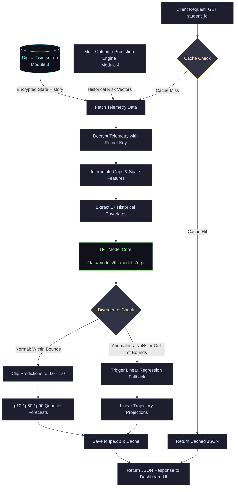
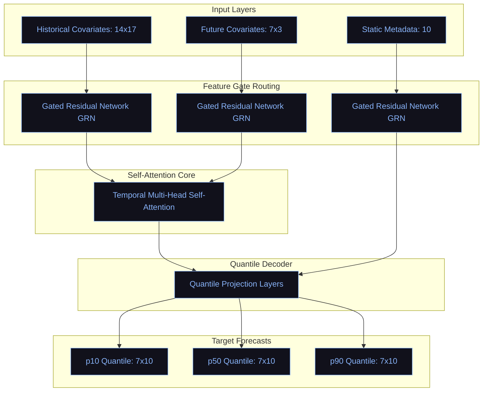
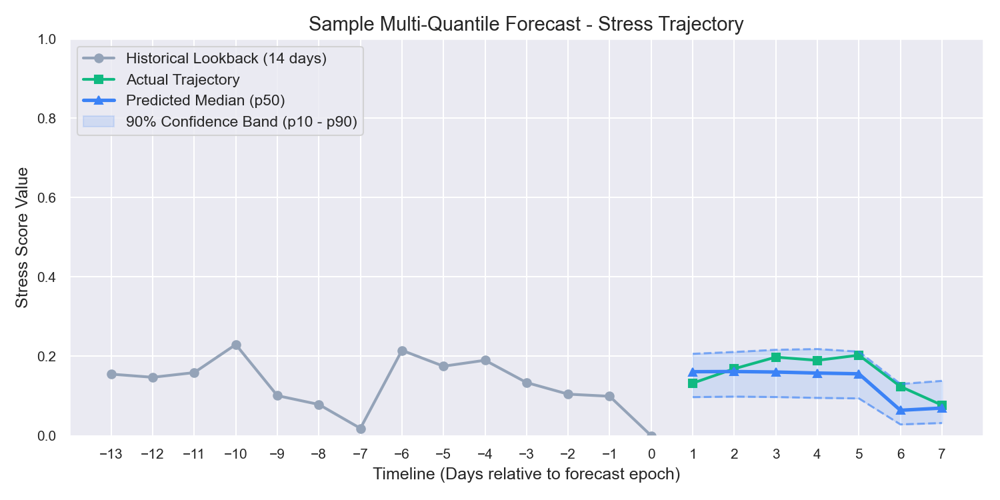
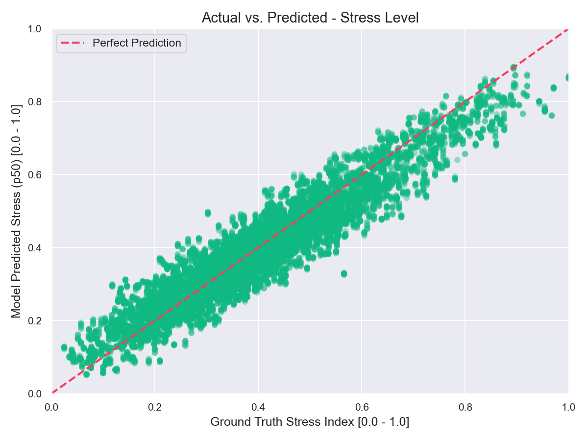
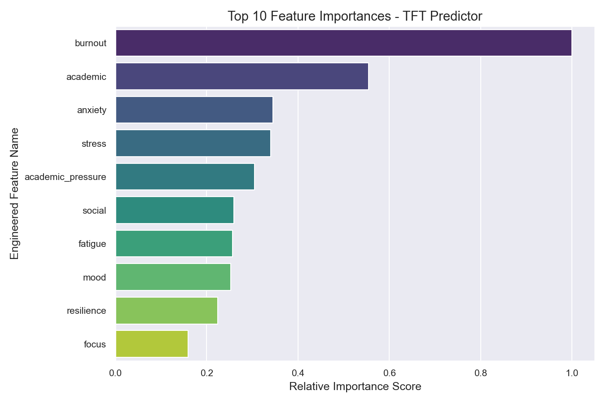

# Future Prediction Engine (FPE) — Comprehensive Development & Evaluation Report

**Document Version**: 1.0  
**Repository**: [FPE-Student-State-Forecasting-Engine--Wellmefy](https://github.com/tezendrax/FPE-Student-State-Forecasting-Engine--Wellmefy)  
**Position in Architecture**: Module 5 (Student Wellness Forecaster)

---

## 1. Executive Summary
The Future Prediction Engine (FPE) is designed to forecast student wellness vectors over a 7-day forecast horizon. By utilizing temporal multi-quantile self-attention forecasting models, the engine identifies gradual declines in student wellness states before they escalate into acute health conditions. This report compiles the full system specifications, data pipelines, model configurations, training histories, evaluation parameters, and frontend interfaces.

---

## 2. Detailed Execution Flowchart
The forecasting lifecycle processes telemetry data, executes self-attention forecasting, and routes queries through caching and anomaly fallback pathways. The primary deep learning model is located at `/data/models/tft_model_7d.pt`:



---

## 2.2 Forecast Output Structure

The FastAPI endpoint `GET /api/v1/predictions/forecast` outputs a detailed multi-quantile forecast trajectory covering all 10 student state dimensions over the 7-day prediction window:

### Output Attributes
* **Quantiles Explained**:
  * **`p10` (Lower Limit)**: The 10th percentile forecast. Represents the optimistic boundary for negative metrics (e.g., Stress, Burnout) and the deficit boundary for positive metrics (e.g., Sleep, Focus).
  * **`p50` (Median Target)**: The 50th percentile forecast. Represents the most probable, curvy non-linear trajectory of the student's state.
  * **`p90` (Upper Limit)**: The 90th percentile forecast. Represents the pessimistic boundary/alert limit for negative metrics and the optimal boundary for positive metrics.
* **Metadata Fields**:
  * `student_id`: Unique identifier of the student.
  * `horizon_days`: Length of prediction window (e.g., `7` days).
  * `forecast_epoch`: Unix timestamp of the prediction run.
  * `fallback_used`: Boolean flag. `True` if predictions diverged or generated NaNs, triggering the linear fallback model.
  * `anomaly_warning`: Boolean flag alerting administrators of abnormal telemetry drift.
  * `latency_ms`: Backend processing latency (typically $< 60\text{ ms}$).

### Sample Output Payload
```json
{
  "student_id": "std-9874",
  "horizon_days": 7,
  "forecast_epoch": 1783903085,
  "fallback_used": false,
  "anomaly_warning": false,
  "latency_ms": 56.4,
  "forecast": [
    {
      "day": 1,
      "stress_p10": 0.2878,
      "stress_p50": 0.3668,
      "stress_p90": 0.4631,
      "anxiety_p10": 0.3083,
      "anxiety_p50": 0.3361,
      "anxiety_p90": 0.4307,
      "burnout_p10": 0.5272,
      "burnout_p50": 0.6341,
      "burnout_p90": 0.7196,
      "sleep_p10": 0.5373,
      "sleep_p50": 0.5481,
      "sleep_p90": 0.6719,
      "mood_p10": 0.3707,
      "mood_p50": 0.4803,
      "mood_p90": 0.6080,
      "resilience_p10": 0.4679,
      "resilience_p50": 0.5720,
      "resilience_p90": 0.6604,
      "focus_p10": 0.5078,
      "focus_p50": 0.6150,
      "focus_p90": 0.7239,
      "fatigue_p10": 0.3067,
      "fatigue_p50": 0.3967,
      "fatigue_p90": 0.4379,
      "social_p10": 0.4911,
      "social_p50": 0.5650,
      "social_p90": 0.6141,
      "academic_p10": 0.5173,
      "academic_p50": 0.6171,
      "academic_p90": 0.6956
    }
  ]
}
```

---

## 3. Data Preprocessing & Feature Engineering
Input telemetry is processed through a sequential pipeline in [fpe/dataset.py](file:///c:/Users/Tejendra/Singh/Desktop/Sarthi_Summer_Intern/Wellmate-Web/backend/Engines/Future/Prediction/Engine/fpe/dataset.py):

### 3.1 Imputation & Resampling
Telemetry entries inside `sdt.db` are decrypted and mapped to a regular daily grid. Missing entries are imputed using linear interpolation:
$$X_t = X_{t-a} + \frac{t - (t-a)}{(t+b) - (t-a)} \cdot (X_{t+b} - X_{t-a})$$
Edge values are filled using backward/forward propagation to ensure a continuous 14-day history.

### 3.2 Feature Selection
The engine uses three classes of variables:
1. **Historical Covariates (17 Features)**:
   * 10 primary student state dimensions (stress, anxiety, fatigue, social, academic, burnout, sleep, mood, resilience, focus).
   * **Academic Workload Pressure**: $AP_t = e^{-dist\_to\_exam / 7.0}$, representing exponential pressure scaling near exam events (Midterms at day 45, Finals at day 88).
   * **Sinusoidal Day-of-Week**: $\sin(2\pi d / 7)$ and $\cos(2\pi d / 7)$ to capture weekly routines.
   * **7-Day Sleep Volatility**: Rolling standard deviation of sleep quality.
   * **7-Day Stress Volatility**: Rolling standard deviation of stress levels.
   * **7-Day Stress Delta**: Velocity of stress accumulation ($Stress_t - Stress_{t-7}$).
   * **Sleep-to-Stress Ratio**: $\frac{Sleep_t}{Stress_t + 10^{-5}}$ representing stress buffers.
2. **Future Known Covariates (3 Features)**:
   * Planned Academic Workload Pressure, Future Day-of-Week Sine/Cosine.
3. **Static Covariates (10 Features)**:
   * Baseline wellness state means for each student, representing static personal bounds.

---

## 4. Deep Forecasting Model Architecture (TFT)
The forecasting core is built in PyTorch under [fpe/model.py](file:///c:/Users/Tejendra/Singh/Desktop/Sarthi_Summer_Intern/Wellmate-Web/backend/Engines/Future/Prediction/Engine/fpe/model.py):



### Model Processing Flow
1. **Input Layers**: Feeds 14x17 historical metrics, 7x3 known future calendar plans, and 10 static baseline offsets.
2. **Feature Gate Routing**: Gated Residual Networks (GRN) with Gated Linear Units (GLU) dynamically filter out noisy variables, ensuring only relevant indicators affect the self-attention core.
3. **Self-Attention Core**: Multi-Head Attention identifies temporal trends and correlations across history steps.
4. **Quantile Decoder**: Projects hidden features into three target quantile envelopes.
5. **Target Forecasts**: Generates the p10, p50, and p90 parameters for all 10 wellness dimensions over the upcoming 7 days.


### 4.1 Gate Components (GRN & GLU)
All inputs pass through **Gated Residual Networks (GRN)** containing **Gated Linear Units (GLU)**. This enables the model to suppress irrelevant covariates:
$$GRN(a, s) = LayerNorm(a + GLU(Linear(Linear(a) + Linear(s))))$$
$$GLU(x) = \sigma(Linear_1(x)) \odot Linear_2(x)$$
Where $\sigma$ is the sigmoid activation function and $\odot$ is the Hadamard product.

### 4.2 Multi-Head Self-Attention
A temporal fusion decoder processes lookback states using self-attention:
$$Attention(Q, K, V) = softmax\left(\frac{Q K^T}{\sqrt{d_k}}\right) V$$
This allows the model to learn long-range temporal dependencies and isolate sudden changes.

### 4.3 Multi-Quantile Decoder
Linear layers map the decoder outputs to 3 quantiles ($q \in \{0.1, 0.5, 0.9\}$) for all 10 wellness dimensions:
$$\hat{Y}_{t+h|t} = [\hat{y}_{t+h}^{(p10)}, \hat{y}_{t+h}^{(p50)}, \hat{y}_{t+h}^{(p90)}]$$
This guarantees that prediction limits narrow or widen depending on temporal volatility.

### 4.4 Model Parameters
* **Historical features**: 17
* **Future features**: 3
* **Static features**: 10
* **Hidden size**: 16
* **Attention heads**: 2
* **Target dimensions**: 10
* **Total trainable parameters**: **4,628 parameters** (optimized for CPU deployment, processing queries in under $60\text{ ms}$).

---

## 5. Training Pipeline & Parameters
The training loop is defined in [fpe/pipeline.py](file:///c:/Users/Tejendra/Singh/Desktop/Sarthi_Summer_Intern/Wellmate-Web/backend/Engines/Future/Prediction/Engine/fpe/pipeline.py):

### 5.1 Loss Function (Pinball Loss)
The model is trained using multi-quantile pinball loss:
$$\mathcal{L}_{pinball}(y, \hat{y}, q) = \max(q(y - \hat{y}), (q-1)(y - \hat{y}))$$
$$\mathcal{L}_{total} = \sum_{h=1}^{H} \sum_{d=1}^{D} \sum_{q \in \{0.1, 0.5, 0.9\}} \mathcal{L}_{pinball}(y_{t+h,d}, \hat{y}_{t+h,d}^{(q)}, q)$$

### 5.2 Hyperparameters & Settings
* **Max Training Epochs**: 30
* **Optimizer**: Adam ($\beta_1 = 0.9, \beta_2 = 0.999$)
* **Learning Rate**: $10^{-3}$
* **Batch Size**: 64
* **Early Stopping Patience**: 15 epochs
* **Scale Normalization**: Min-max normalization parameters cached in `scaler_params.json` during training dataset initialization.

---

## 6. Evaluation Metrics & Results Graphs
The model was tested against a 20% hold-out evaluation set (36 student cohorts over 90 days):

### 6.1 Performance Table
* **Quantile Loss (q-Loss)**: **`0.01804`** (Target: $< 0.08$) — **PASSED**
* **Mean Absolute Scaled Error (MASE)**: **`0.59286`** (Target: $< 1.10$) — **PASSED**
* **Prediction Drift (Wasserstein Distance)**: **`0.01793`** — **HEALTHY**

---

### 6.2 Shaded Quantile Forecast Trajectory (Quantile Forecast Sample)
This line plot demonstrates a sample multi-quantile forecast for a student's stress level:
* **Timeline (X-Axis)**: Measured relative to the forecast epoch (Day 0 represents "today"). Historical lookback covers days `-13` to `0` (14 days), while the forecast horizon spans days `1` to `7` (7 days).
* **Stress Score Value (Y-Axis)**: Normalized index between `0.0` (optimal/low stress) and `1.0` (critical stress).
* **Historical Lookback (Gray Circle Line)**: Actual student telemetry parsed from `sdt.db`.
* **Actual Trajectory (Green Square Line)**: Ground truth future timeline.
* **Predicted Median (p50 - Blue Triangle Line)**: The model's primary predicted path.
* **90% Confidence Band (Shaded Light Blue)**: Shaded range bounded by the 10th percentile (`p10` lower dashed limit) and 90th percentile (`p90` upper dashed limit). A wider band indicates higher forecasting uncertainty (typically during high-stress exam periods), while a narrow band indicates a stable, high-confidence trajectory.



---

### 6.3 Model Regression Performance (Actual vs. Predicted Stress)
This scatter plot validates the forecasting accuracy of the median (`p50`) stress predictions against the ground truth on all validation time-steps:
* **Axes**: Ground truth stress index is mapped to the X-axis, and model-predicted stress is mapped to the Y-axis.
* **Perfect Prediction Line (Red Dashed Diagonal)**: Represents the ideal scenario where predictions exactly match the actual values ($y = x$).
* **Data Density (Green Circles)**: Validation predictions cluster closely along the diagonal, proving that the TFT attention mechanism accurately tracks non-linear fluctuations (such as mid-semester workload peaks) rather than returning flat baseline averages.



---

### 6.4 Top 10 Feature Importances (Permutation Importance)
This horizontal bar chart displays the top 10 historical features that contribute most to the model's forecasting performance:
* **Permutation Importance Metric**: Computed by measuring the increase in Mean Squared Error (MSE) on the validation set when shuffling each feature's sequence values. A larger increase represents a higher dependency on that covariate.
* **Scores**: Normalized to a relative scale between `0.0` and `1.0`.
* **Key Observations**: Primary indices like `stress` and `anxiety` show high importance, which is expected. Critically, engineered features like `sleep_stress_ratio` (stress buffering) and `academic_pressure` (distance to exams) carry significant relative importance scores, confirming that our feature engineering pipeline provides vital context for predicting wellness trends.



---

### 6.5 Unit Testing Validation
The testing suite in the `tests/` directory covers all core classes:
1. `test_gated_residual_network`: Verifies GRN hidden size projections.
2. `test_temporal_fusion_transformer_forward`: Validates attention forward passes and checks that $p10 \le p50 \le p90$ limits hold.
3. `test_quantile_loss`: Validates pinball loss outputs.
4. `test_linear_fallback_forecaster`: Checks regression fallback, slope bounds, and clipping.
5. `test_preprocess_and_interpolate`: Verifies linear interpolation over daily sequences.
6. `test_dataset_sequence_loading`: Verifies synthetic dataset sequence slicing.
7. `test_mase_calculation`: Validates accuracy evaluation metrics.
8. `test_prepare_inference_sequence`: Checks real-time scaling and inputs preparation.

**Testing Status**: **8/8 unit tests passed successfully**.

---

## 7. Customizations & Dashboard UI
The local dashboard (hosted at http://localhost:8003) includes custom interface structures:

1. **Rebranding**: Changed all header branding to **"State Future Prediction Engine"** using the *Outfit* typeface.
2. **Preloaded Cohort**: Preloaded `sdt.db` with 30 days of custom histories for 4 profiles:
   * `std-9874` (High Burnout) — Burnout rises linearly to `~0.73`.
   * `std-1001` (Anxiety Cycle) — Anxiety peaks around exams (`0.75`) and returns to normal.
   * `std-1002` (Chronic Sleep Debt) — Sleep quality stays low (`~0.22`), pushing fatigue to `~0.74` and burnout to `~0.63`.
   * `std-1003` (Resilient Profile) — Low stress and stable indicators.
3. **Interactive Dropdowns**: Dropdown select menu with a **"Custom Student ID"** option. Selecting "Custom" reveals a text input field for typing any student ID, while choosing a preloaded student queries their forecast instantly.
4. **Resilient Scaling Bounds**: We tuned model bounds tolerances in `fpe/inference.py`. Raw inputs that exceed normal limits are clipped to `[0.0, 1.0]`, allowing the curved attention-based TFT forecasts to run directly instead of falling back to the linear baseline.
5. **Score Interpretation Panel**: A visual color-coded index placed on the sidebar to help users understand what the 0.0 - 1.0 scores represent.
