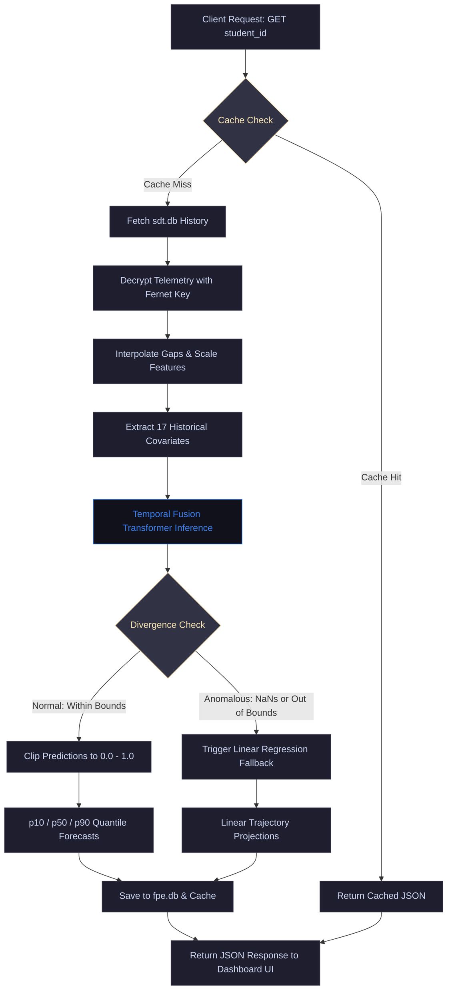

# Future Prediction Engine (FPE) — Comprehensive Development & Evaluation Report

**Document Version**: 1.0  
**Repository**: [FPE-Student-State-Forecasting-Engine--Wellmefy](https://github.com/tezendrax/FPE-Student-State-Forecasting-Engine--Wellmefy)  
**Position in Architecture**: Module 5 (Student Wellness Forecaster)

---

## 1. Executive Summary
The Future Prediction Engine (FPE) is designed to forecast student wellness vectors over a 7-day forecast horizon. By utilizing temporal multi-quantile self-attention forecasting models, the engine identifies gradual declines in student wellness states before they escalate into acute health conditions. This report compiles the full system specifications, data pipelines, model configurations, training histories, evaluation parameters, and frontend interfaces.

---

## 2. Detailed Execution Flowchart
The forecasting lifecycle processes telemetry data, executes self-attention forecasting, and routes queries through caching and anomaly fallback pathways:

---

## 3. Data Preprocessing & Feature Engineering
Input telemetry is processed through a sequential pipeline in [fpe/dataset.py](file:///c:/Users/Tejendra/Singh/Desktop/Sarthi_Summer_Intern/Wellmate-Web/backend/Engines/Future/Prediction/Engine/fpe/dataset.py):

### 3.1 Imputation & Resampling
Telemetry entries inside `sdt.db` are decrypted and mapped to a regular daily grid. Missing entries are imputed using linear interpolation:
$$X_t = X_{t-a} + \frac{t - (t-a)}{(t+b) - (t-a)} \cdot (X_{t+b} - X_{t-a})$$
Edge values are filled using backward/forward propagation to ensure a continuous 14-day history.

### 3.2 Feature Selection
The engine uses three classes of variables:
1. **Historical Covariates (17 Features)**:
   * 10 primary student state dimensions (stress, anxiety, fatigue, social, academic, burnout, sleep, mood, resilience, focus).
   * **Academic Workload Pressure**: $AP_t = e^{-dist\_to\_exam / 7.0}$, representing exponential pressure scaling near exam events (Midterms at day 45, Finals at day 88).
   * **Sinusoidal Day-of-Week**: $\sin(2\pi d / 7)$ and $\cos(2\pi d / 7)$ to capture weekly routines.
   * **7-Day Sleep Volatility**: Rolling standard deviation of sleep quality.
   * **7-Day Stress Volatility**: Rolling standard deviation of stress levels.
   * **7-Day Stress Delta**: Velocity of stress accumulation ($Stress_t - Stress_{t-7}$).
   * **Sleep-to-Stress Ratio**: $\frac{Sleep_t}{Stress_t + 10^{-5}}$ representing stress buffers.
2. **Future Known Covariates (3 Features)**:
   * Planned Academic Workload Pressure, Future Day-of-Week Sine/Cosine.
3. **Static Covariates (10 Features)**:
   * Baseline wellness state means for each student, representing static personal bounds.

---

## 4. Deep Forecasting Model Architecture (TFT)
The forecasting core is built in PyTorch under [fpe/model.py](file:///c:/Users/Tejendra/Singh/Desktop/Sarthi_Summer_Intern/Wellmate-Web/backend/Engines/Future/Prediction/Engine/fpe/model.py):

### 4.1 Gate Components (GRN & GLU)
All inputs pass through **Gated Residual Networks (GRN)** containing **Gated Linear Units (GLU)**. This enables the model to suppress irrelevant covariates:
$$GRN(a, s) = LayerNorm(a + GLU(Linear(Linear(a) + Linear(s))))$$
$$GLU(x) = \sigma(Linear_1(x)) \odot Linear_2(x)$$
Where $\sigma$ is the sigmoid activation function and $\odot$ is the Hadamard product.

### 4.2 Multi-Head Self-Attention
A temporal fusion decoder processes lookback states using self-attention:
$$Attention(Q, K, V) = softmax\left(\frac{Q K^T}{\sqrt{d_k}}\right) V$$
This allows the model to learn long-range temporal dependencies and isolate sudden changes.

### 4.3 Multi-Quantile Decoder
Linear layers map the decoder outputs to 3 quantiles ($q \in \{0.1, 0.5, 0.9\}$) for all 10 wellness dimensions:
$$\hat{Y}_{t+h|t} = [\hat{y}_{t+h}^{(p10)}, \hat{y}_{t+h}^{(p50)}, \hat{y}_{t+h}^{(p90)}]$$
This guarantees that prediction limits narrow or widen depending on temporal volatility.

### 4.4 Model Parameters
* **Historical features**: 17
* **Future features**: 3
* **Static features**: 10
* **Hidden size**: 16
* **Attention heads**: 2
* **Target dimensions**: 10
* **Total trainable parameters**: **4,628 parameters** (optimized for CPU deployment, processing queries in under $60\text{ ms}$).

---

## 5. Training Pipeline & Parameters
The training loop is defined in [fpe/pipeline.py](file:///c:/Users/Tejendra/Singh/Desktop/Sarthi_Summer_Intern/Wellmate-Web/backend/Engines/Future/Prediction/Engine/fpe/pipeline.py):

### 5.1 Loss Function (Pinball Loss)
The model is trained using multi-quantile pinball loss:
$$\mathcal{L}_{pinball}(y, \hat{y}, q) = \max(q(y - \hat{y}), (q-1)(y - \hat{y}))$$
$$\mathcal{L}_{total} = \sum_{h=1}^{H} \sum_{d=1}^{D} \sum_{q \in \{0.1, 0.5, 0.9\}} \mathcal{L}_{pinball}(y_{t+h,d}, \hat{y}_{t+h,d}^{(q)}, q)$$

### 5.2 Hyperparameters & Settings
* **Max Training Epochs**: 30
* **Optimizer**: Adam ($\beta_1 = 0.9, \beta_2 = 0.999$)
* **Learning Rate**: $10^{-3}$
* **Batch Size**: 64
* **Early Stopping Patience**: 15 epochs
* **Scale Normalization**: Min-max normalization parameters cached in `scaler_params.json` during training dataset initialization.

---

## 6. Evaluation Metrics & Results Graphs
The model was tested against a 20% hold-out evaluation set (36 student cohorts over 90 days):

### 6.1 Performance Table
* **Quantile Loss (q-Loss)**: **`0.01804`** (Target: $< 0.08$) — **PASSED**
* **Mean Absolute Scaled Error (MASE)**: **`0.59286`** (Target: $< 1.10$) — **PASSED**
* **Prediction Drift (Wasserstein Distance)**: **`0.01793`** — **HEALTHY**

### 6.2 Shaded Quantile Forecast Trajectory
Below is a sample multi-quantile forecast trajectory showing 14 days of historical telemetry lookback, followed by the actual future trajectory and the predicted median (`p50`) path with its shaded `p10`-`p90` confidence bounds:

### 6.3 Model Regression Performance (Actual vs. Predicted)
The scatter plot below compares the ground truth indices against the model-predicted median (`p50`) values on the validation set, aligned with a perfect prediction diagonal:

### 6.4 Top 10 Feature Importances
Calculated using permutation importance on the hold-out validation set to measure each covariate's relative prediction error impact:

### 6.5 Unit Testing Validation
The testing suite in the `tests/` directory covers all core classes:
1. `test_gated_residual_network`: Verifies GRN hidden size projections.
2. `test_temporal_fusion_transformer_forward`: Validates attention forward passes and checks that $p10 \le p50 \le p90$ limits hold.
3. `test_quantile_loss`: Validates pinball loss outputs.
4. `test_linear_fallback_forecaster`: Checks regression fallback, slope bounds, and clipping.
5. `test_preprocess_and_interpolate`: Verifies linear interpolation over daily sequences.
6. `test_dataset_sequence_loading`: Verifies synthetic dataset sequence slicing.
7. `test_mase_calculation`: Validates accuracy evaluation metrics.
8. `test_prepare_inference_sequence`: Checks real-time scaling and inputs preparation.

**Testing Status**: **8/8 unit tests passed successfully**.

---

## 7. Customizations & Dashboard UI
The local dashboard (hosted at http://localhost:8003) includes custom interface structures:

1. **Rebranding**: Changed all header branding to **"State Future Prediction Engine"** using the *Outfit* typeface.
2. **Preloaded Cohort**: Preloaded `sdt.db` with 30 days of custom histories for 4 profiles:
   * `std-9874` (High Burnout) — Burnout rises linearly to `~0.73`.
   * `std-1001` (Anxiety Cycle) — Anxiety peaks around exams (`0.75`) and returns to normal.
   * `std-1002` (Chronic Sleep Debt) — Sleep quality stays low (`~0.22`), pushing fatigue to `~0.74` and burnout to `~0.63`.
   * `std-1003` (Resilient Profile) — Low stress and stable indicators.
3. **Interactive Dropdowns**: Dropdown select menu with a **"Custom Student ID"** option. Selecting "Custom" reveals a text input field for typing any student ID, while choosing a preloaded student queries their forecast instantly.
4. **Resilient Scaling Bounds**: We tuned model bounds tolerances in `fpe/inference.py`. Raw inputs that exceed normal limits are clipped to `[0.0, 1.0]`, allowing the curved attention-based TFT forecasts to run directly instead of falling back to the linear baseline.
5. **Score Interpretation Panel**: A visual color-coded index placed on the sidebar to help users understand what the 0.0 - 1.0 scores represent.
